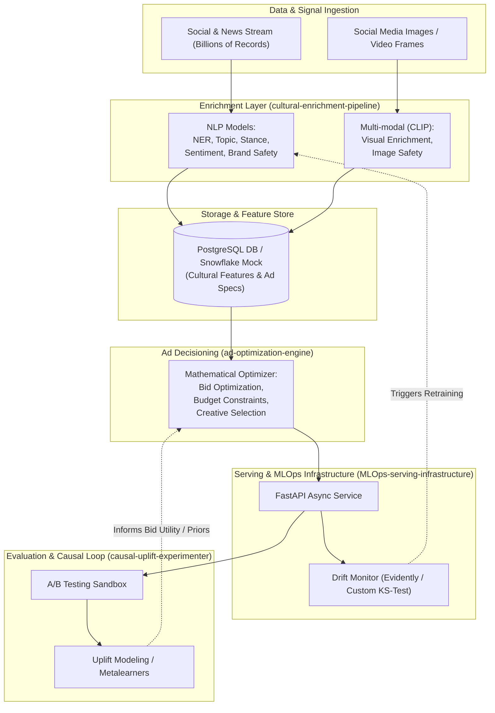
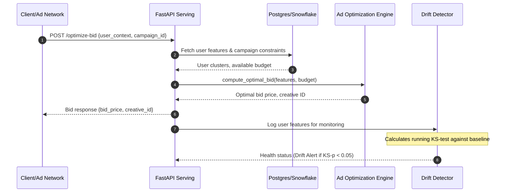

# 🏛️ System Architecture Overview

This document describes the high-level architecture, module boundaries, data flows, and design principles of the ML Mastery Sandbox.

---

## System Architecture Diagram

The sandbox models a real-time data and optimization engine. The diagram below illustrates how social media posts, news records, and images flow through the enrichment models, populate the database, inform the ad optimization engine, and are evaluated via A/B testing and drift monitoring.

---

## Sub-Project Module Boundaries

### 1. Cultural Enrichment Pipeline (`cultural-enrichment-pipeline`)
*   **Responsibility**: Transform unstructured textual and visual content into structured, high-dimensional representations and safety flags.
*   **Inputs**: Raw text records, raw image files.
*   **Key Modules**:
    *   `text_enrichment.py`: HuggingFace transformers pipeline (or scikit-learn models) for topic/stance classification, NER, and brand safety.
    *   `multimodal_enrichment.py`: Vision-Language features using CLIP to evaluate image safety and topic alignment.
    *   `clustering.py`: Sentence embeddings and clustering algorithms (e.g. K-Means, HDBSCAN) to discover emerging cultural trends.

### 2. Ad Optimization Engine (`ad-optimization-engine`)
*   **Responsibility**: Allocate ad budget, select the best creative, and compute bid values to maximize performance under constraints.
*   **Inputs**: Historical campaign metrics, budget limits, user target vectors, bidding objectives.
*   **Key Modules**:
    *   `bid_optimizer.py`: Solves utility maximization models using linear programming or heuristic search.
    *   `budget_allocator.py`: Solves optimization problems like knapsack or linear programming for budget distribution across ad sets.
    *   `creative_bandit.py`: Multi-Armed Bandit policy (e.g. Thompson Sampling or UCB1) for matching creatives to target audiences.

### 3. Causal Uplift & Experimenter (`causal-uplift-experimenter`)
*   **Responsibility**: Design experiments, compute sample sizes, and analyze causal treatment effects (e.g., ad exposure vs. brand recall).
*   **Inputs**: Randomized control trial data, observational data with confounders.
*   **Key Modules**:
    *   `power_calculator.py`: Power analysis calculations to determine sample size (Minimum Detectable Effect, Significance Level, Statistical Power).
    *   `stat_tests.py`: Statistical significance tests (t-test, Chi-square, ANOVA).
    *   `uplift_model.py`: Metalearners (S-Learner, T-Learner, X-Learner) to estimate Conditional Average Treatment Effects (CATE) for uplift targeting.

### 4. MLOps Serving Infrastructure (`MLOps-serving-infrastructure`)
*   **Responsibility**: Serve predictions with low latency and monitor the health and distribution shifts of incoming production data.
*   **Inputs**: FastAPI requests, live model inference logs.
*   **Key Modules**:
    *   `main.py`: FastAPI server showcasing asynchronous endpoints, schema validation, and health checks.
    *   `drift_detector.py`: Scikit-learn / SciPy implementation of the Kolmogorov-Smirnov test and Population Stability Index (PSI) to detect data drift.
    *   `docker-compose.yml` / `Dockerfile`: Containment templates for reproducible deployments.

---

## Global Data Flow

